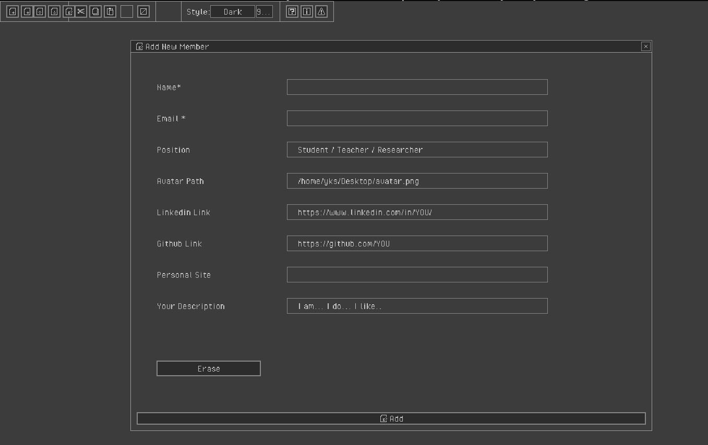

**HugoCMS: An Effortless GUI for Uploading Content to Hugo-Based Static Blogs**

HugoCMS is a user-friendly immediate-mode GUI designed for seamlessly uploading content to static blogs powered by Hugo. This application leverages `raygui` and functions as a "pull request maker" for repositories that integrate workflows for building and deploying sites.

`raygui` serves as a companion module for [raylib](https://github.com/raysan5/raylib), facilitating the creation of simple GUI interfaces in the distinctive raylib graphic style, characterized by straightforward colors, plain rectangular shapes, and bold borders. While tailored for raylib, `raygui` can be adapted for use with other engines and frameworks.

Primarily aimed at **tool development**, `raygui` has been successfully employed to create various published tools, showcasing its versatility and ease of use. For more examples, check out [this collection of published tools](https://raylibtech.itch.io).

 

- sudo apt-get install libcurl4-openssl-dev

