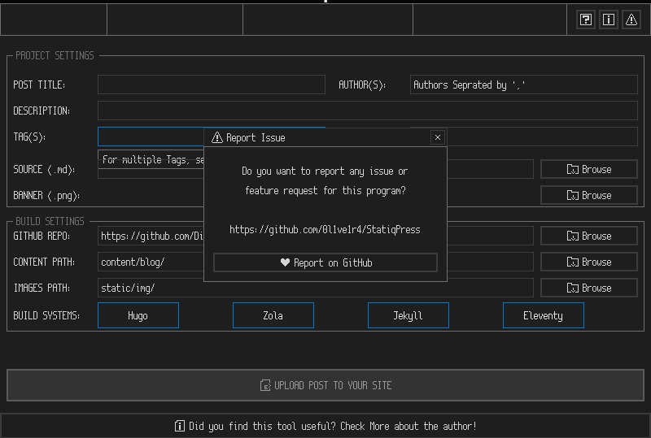

# StatiqPress

**Effortless GUI for Uploading Content to GitHub Static Blogs, based by [raysan5](https://github.com/raysan5/raylib_project_creator)**

StatiqPress is a user-friendly, immediate-mode GUI designed to simplify the process of uploading content to static blogs powered by GitHub workflows. This application acts as a "pull request maker" for repositories that integrate workflows for building and deploying sites.

Built entirely in C, StatiqPress is lightweight and can run on any system with a monitor (unless I forgot to free some malloc).

> **OBVIOUS NOTICE:**
>
>  You must have Git (CLI) installed and configured with an account that has access to the repository for your site.

## Features

- **Intuitive Interface:** Enjoy a straightforward GUI experience for managing your static blog content.
- **Git Integration:** Utilizes the Git interface for interaction with your GitHub repositories.
- **Built with `raygui`:** Designed using `raygui`, a companion module for [raylib](https://github.com/raysan5/raylib).


## Contributing

We welcome contributions! Please adhere to the following guidelines:

- Fork the repository and create a new branch for your feature or bug fix.
- Ensure that your code adheres to the project's style guidelines.
- Submit a pull request for review.

#### Requirements for contribuiting:

- **raylib and raygui:**

### Installation Instructions

1. **Clone the Repository:**
   ```bash
   git clone https://github.com/yourusername/StatiqPress.git
   cd StatiqPress
   ```

2. **Build the Application:**
   Follow the specific instructions in the `build.sh` file to compile StatiqPress.


For any issues or suggestions, feel free to open an issue in the repository.

## License

This project is licensed under the GNU PUBLIC LICENSE 3. See the `LICENSE` file for more details.

---